# Prompt 0.2.5.2: Module Specification Creation

## Task Description
Create detailed module specifications for all 5 core modules using the module_spec_schema.yaml. Each module gets its own YAML file with complete details about responsibilities, dependencies, functions, and implementation guidance.

## Context Gathering
```bash
python3 tools/doc_query.py --query "spec/spec.yaml" --mode file --pretty | grep -A 50 "modules"
python3 tools/doc_query.py --query "spec/schemas/module_spec_schema.yaml" --mode file --pretty
python3 tools/doc_query.py --query "phase_1" --mode text --pretty
python3 tools/doc_query.py --query "phase_2" --mode text --pretty
```

## Requirements

Create 5 module specification files following spec/schemas/module_spec_schema.yaml:

### 1. spec/modules/frontend_svelte.yaml
- Complete module specification for Svelte frontend
- List all major components and their responsibilities
- Define data flow from backend APIs
- Specify state management approach
- List all functions (component methods, utilities)
- Include LLM guidance for Svelte/Tailwind implementation

### 2. spec/modules/backend_node.yaml
- Complete module specification for Node.js backend
- List all API endpoints (reference to apis.yaml)
- Define service layer functions
- Specify data access patterns
- Define OpenRouter integration functions
- Include LLM guidance for Fastify implementation

### 3. spec/modules/backend_python_tools.yaml
- Complete module specification for Python tools backend
- List all tool endpoints
- Define Jinja2 template rendering functions
- Specify code execution sandbox approach
- Include LLM guidance for FastAPI implementation

### 4. spec/modules/git_integration.yaml
- Complete module specification for Git operations
- List all Git functions (init, commit, push, status, diff)
- Define auto-commit batching logic
- Specify conflict resolution approach
- Include LLM guidance for simple-git usage

### 5. spec/modules/logging_and_metrics.yaml
- Complete module specification for logging
- Define log entry types and schemas
- Specify log storage and retrieval
- Define metrics collection approach
- Include LLM guidance for structured logging

## Module Dependencies Diagram

Create **docs/diagrams/module_dependencies.mmd**:

```mermaid
graph TD
    FE[Frontend Svelte]
    BN[Backend Node]
    BP[Backend Python Tools]
    GI[Git Integration]
    LM[Logging & Metrics]
    
    FE -->|REST API| BN
    BN -->|Tool Calls| BP
    BN -->|Git Ops| GI
    BN -->|Log Events| LM
    BP -->|Log Events| LM
    GI -->|Log Events| LM
    
    BN -->|OpenRouter| OR[OpenRouter API]
    GI -->|Git Commands| GIT[Git CLI]
    
    style FE fill:#4a5568
    style BN fill:#2d3748
    style BP fill:#1a202c
    style GI fill:#2c5282
    style LM fill:#2b6cb0
```



## Expected Outputs

1. **spec/modules/frontend_svelte.yaml** - Complete module spec
2. **spec/modules/backend_node.yaml** - Complete module spec
3. **spec/modules/backend_python_tools.yaml** - Complete module spec
4. **spec/modules/git_integration.yaml** - Complete module spec
5. **spec/modules/logging_and_metrics.yaml** - Complete module spec
6. **docs/diagrams/module_dependencies.mmd** - Module dependency diagram

## Verification Steps

1. Validate all module specs against schema:
   ```bash
   python3 verify/validate_module_specs.py
   ```

2. Check that all module dependencies are valid references

3. Verify all functions listed have clear purposes

4. Ensure LLM guidance is comprehensive

5. Render module dependency diagram

## Notes

- Each module spec should be 200-400 lines
- Focus on Phase 1-2 functionality
- Include clear boundaries (in-scope/out-of-scope)
- List all significant functions (detailed specs come in next task)
- Provide actionable LLM guidance