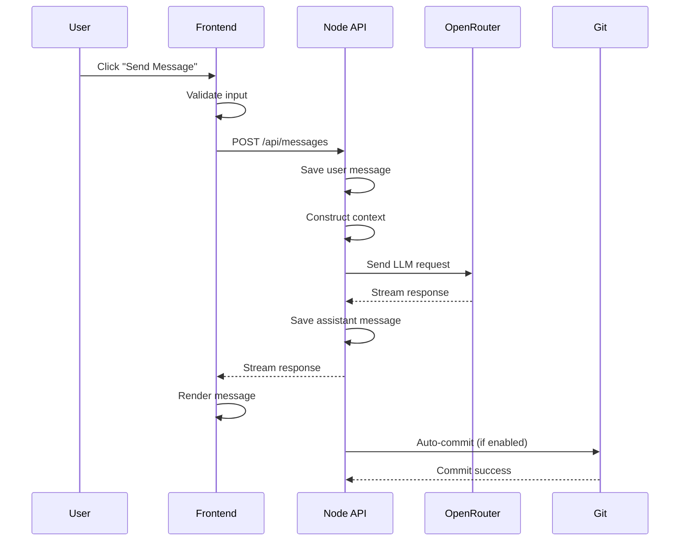

# Prompt 0.2.5.4: API & Interaction Detail

## Task Description
Expand spec/apis.yaml and spec/ui.yaml with complete endpoint specifications and interaction flows. Define every API endpoint with request/response schemas, and every UI interaction with state changes and API calls.

## Context Gathering
```bash
python3 tools/doc_query.py --query "spec/apis.yaml" --mode file --pretty
python3 tools/doc_query.py --query "spec/ui.yaml" --mode file --pretty
python3 tools/doc_query.py --query "spec/modules/backend_node.yaml" --mode file --pretty
python3 tools/doc_query.py --query "spec/modules/frontend_svelte.yaml" --mode file --pretty
```

## Requirements

### 1. Expand spec/apis.yaml

Add complete endpoint specifications for all Phase 1-2 APIs:

```yaml
version: 1.0.0
title: API Specifications

services:
  node_api:
    base_url: "http://localhost:3000"
    description: "Primary Node.js backend API"
    
    endpoints:
      # Project Management
      - path: /api/projects
        method: POST
        name: createProject
        description: Create a new project
        authentication: none  # Phase 1-2
        
        request:
          content_type: application/json
          schema:
            type: object
            required: [name]
            properties:
              name:
                type: string
                pattern: "^[a-zA-Z0-9_-]+$"
                minLength: 1
                maxLength: 100
              description:
                type: string
                maxLength: 500
              default_model:
                type: string
                default: "openrouter/openai/gpt-4o"
          
          example:
            name: "my-project"
            description: "My awesome project"
            default_model: "openrouter/openai/gpt-4o"
        
        response:
          success:
            status: 201
            content_type: application/json
            schema:
              $ref: "spec/domain.yaml#Project"
            example:
              id: "550e8400-e29b-41d4-a716-446655440000"
              name: "my-project"
              slug: "my-project"
              status: "active"
              created_at: "2024-01-20T10:00:00Z"
              updated_at: "2024-01-20T10:00:00Z"
          
          errors:
            - status: 400
              code: INVALID_PROJECT_NAME
              message: "Project name is invalid"
              example:
                error: "INVALID_PROJECT_NAME"
                message: "Project name must match pattern ^[a-zA-Z0-9_-]+$"
            
            - status: 409
              code: PROJECT_EXISTS
              message: "Project with this name already exists"
              example:
                error: "PROJECT_EXISTS"
                message: "A project named 'my-project' already exists"
            
            - status: 500
              code: INTERNAL_ERROR
              message: "Internal server error"
        
        rate_limit:
          requests: 10
          window: 60  # seconds
        
        function_reference: "spec/functions/backend_node/create_project.yaml"
      
      - path: /api/projects
        method: GET
        name: listProjects
        description: List all projects
        # ... complete specification
      
      - path: /api/projects/:projectId
        method: GET
        name: getProject
        description: Get project by ID
        # ... complete specification
      
      # Continue for all endpoints...
```

Define all endpoints:
- Project CRUD (5 endpoints)
- Chat CRUD (5 endpoints)
- Message operations (4 endpoints)
- Data entity operations (5 endpoints)
- LLM operations (2 endpoints)
- Command execution (1 endpoint)
- Git operations (4 endpoints)

### 2. Expand spec/ui.yaml

Add complete screen specifications and interaction flows:

```yaml
version: 1.0.0
title: UI Specifications

layout:
  type: three_column
  # ... existing layout

screens:
  project_list:
    route: "/"
    title: "Projects"
    description: "List of all projects"
    
    components:
      - name: ProjectList
        type: list
        data_source:
          api: GET /api/projects
          refresh: on_mount
        
        item_template:
          - name: project_name
            type: text
            binding: "project.name"
          - name: last_updated
            type: datetime
            binding: "project.updated_at"
        
        interactions:
          - trigger: click_item
            action: navigate
            target: "/projects/:projectId"
            state_changes:
              - set_current_project
          
          - trigger: click_create
            action: open_modal
            modal: create_project_modal
      
      - name: CreateProjectModal
        type: modal
        
        form:
          fields:
            - name: name
              type: text
              label: "Project Name"
              required: true
              validation:
                pattern: "^[a-zA-Z0-9_-]+$"
                minLength: 1
                maxLength: 100
            
            - name: description
              type: textarea
              label: "Description"
              required: false
        
        interactions:
          - trigger: submit
            validation: validate_form
            api_call:
              method: POST
              endpoint: /api/projects
              body: form_data
            on_success:
              - close_modal
              - refresh_project_list
              - navigate: "/projects/:newProjectId"
            on_error:
              - show_error_message
  
  chat_view:
    route: "/projects/:projectId/chats/:chatId"
    title: "Chat"
    description: "Chat interface with message history"
    
    components:
      - name: MessageList
        type: scrollable_list
        data_source:
          api: GET /api/projects/:projectId/chats/:chatId/messages
          refresh: on_mount, on_new_message
        
        item_template:
          - name: message_content
            type: markdown
            binding: "message.content"
          - name: message_role
            type: badge
            binding: "message.role"
        
        interactions:
          - trigger: scroll_to_bottom
            action: auto_scroll
            condition: new_message_added
      
      - name: MessageInput
        type: textarea
        
        interactions:
          - trigger: submit
            validation: not_empty
            api_call:
              method: POST
              endpoint: /api/projects/:projectId/chats/:chatId/messages
              body:
                role: "user"
                content: input_value
            on_success:
              - clear_input
              - add_message_to_list
              - trigger_llm_response
            on_error:
              - show_error_message
          
          - trigger: detect_slash_command
            condition: "input starts with /"
            action: show_command_autocomplete
    
    state:
      - name: current_project
        type: Project
        source: route_param
      - name: current_chat
        type: Chat
        source: route_param
      - name: messages
        type: Message[]
        source: api
      - name: is_loading
        type: boolean
        default: false
```

### 3. Create Interaction Flow Diagrams

Create **docs/diagrams/interaction_flow.mmd**:



## Expected Outputs

1. **spec/apis.yaml** - Expanded with all endpoint specifications (500+ lines)
2. **spec/ui.yaml** - Expanded with all screen specifications (400+ lines)
3. **docs/diagrams/interaction_flow.mmd** - Interaction sequence diagrams
4. **docs/diagrams/api_flow.mmd** - API call flow diagrams

## Verification Steps

1. Validate API specs have all required fields
2. Check that all API endpoints reference function specs
3. Verify UI interactions reference correct API endpoints
4. Ensure all state changes are documented
5. Validate that all error cases are handled in UI

## Notes

- Every API endpoint must have complete request/response schemas
- Every UI interaction must specify state changes
- All error cases must have UI handling
- Focus on Phase 1-2 screens and endpoints