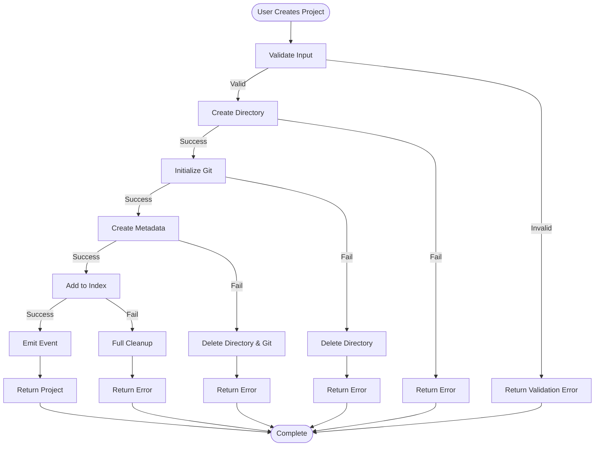
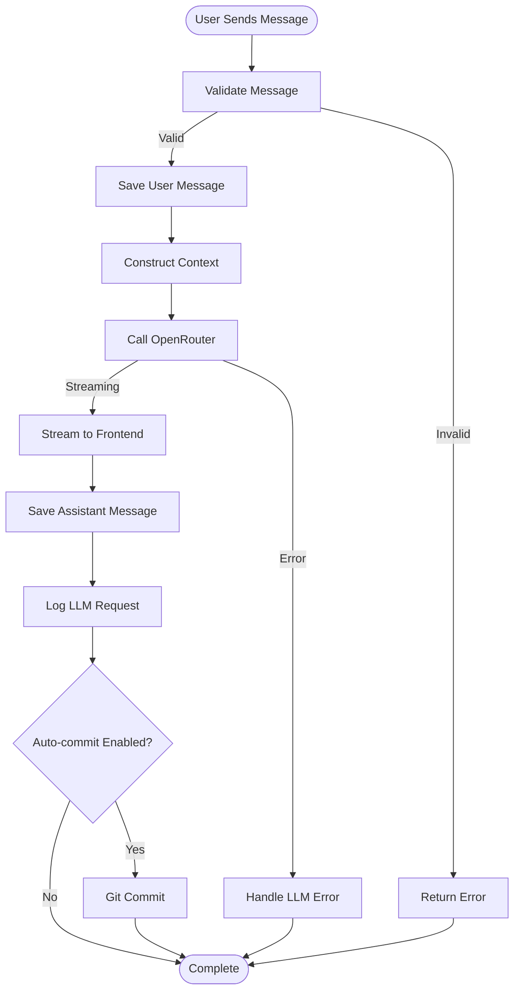

# Prompt 0.2.5.5: Workflow Implementation Specs

## Task Description
Expand spec/workflows.yaml with concrete workflow implementations for Phase 1-2. Define specific workflows with detailed steps, data flows, and state management.

## Context Gathering
```bash
python3 tools/doc_query.py --query "spec/workflows.yaml" --mode file --pretty
python3 tools/doc_query.py --query "spec/commands.yaml" --mode file --pretty
```

## Requirements

### 1. Expand spec/workflows.yaml

Add concrete workflow implementations:

```yaml
# ... existing workflow model ...

concrete_workflows:
  # Phase 1 Workflows
  
  create_project_workflow:
    id: "create_project"
    name: "Create Project Workflow"
    description: "Complete workflow for creating a new project"
    phase: 1
    trigger: "User clicks 'Create Project'"
    
    steps:
      - id: validate_input
        type: validation
        description: "Validate project name and options"
        inputs:
          - name: project_name
            type: string
          - name: options
            type: object
        validation:
          - rule: "name matches pattern"
          - rule: "name is unique"
        outputs:
          - validated_input
        on_error: return_validation_errors
      
      - id: create_directory
        type: io
        description: "Create project directory"
        inputs:
          - validated_input
        function: "backend_node.create_project_directory"
        outputs:
          - project_path
        on_error: cleanup_and_fail
      
      - id: init_git
        type: external
        description: "Initialize Git repository"
        inputs:
          - project_path
        function: "git_integration.init_repository"
        outputs:
          - git_status
        on_error: cleanup_directory_and_fail
      
      - id: create_metadata
        type: data
        description: "Create project metadata file"
        inputs:
          - validated_input
          - project_path
        function: "backend_node.create_project_metadata"
        outputs:
          - project_object
        on_error: cleanup_all_and_fail
      
      - id: add_to_index
        type: data
        description: "Add project to global index"
        inputs:
          - project_object
        function: "backend_node.add_to_project_index"
        outputs:
          - index_entry
        on_error: cleanup_all_and_fail
      
      - id: emit_event
        type: event
        description: "Emit project created event"
        inputs:
          - project_object
        function: "logging_and_metrics.emit_project_created"
        outputs:
          - event_id
      
      - id: return_result
        type: return
        description: "Return created project"
        inputs:
          - project_object
        outputs:
          - project_object
    
    data_flow:
      - from: validate_input
        to: create_directory
        data: validated_input
      
      - from: create_directory
        to: init_git
        data: project_path
      
      - from: validate_input
        to: create_metadata
        data: validated_input
      
      - from: create_directory
        to: create_metadata
        data: project_path
      
      - from: create_metadata
        to: add_to_index
        data: project_object
      
      - from: create_metadata
        to: emit_event
        data: project_object
      
      - from: create_metadata
        to: return_result
        data: project_object
    
    error_handling:
      cleanup_and_fail:
        steps:
          - log_error
          - return_error_response
      
      cleanup_directory_and_fail:
        steps:
          - delete_project_directory
          - log_error
          - return_error_response
      
      cleanup_all_and_fail:
        steps:
          - delete_project_directory
          - remove_from_index
          - log_error
          - return_error_response
    
    state_changes:
      - entity: Project
        from: null
        to: initializing
        at_step: create_directory
      
      - entity: Project
        from: initializing
        to: active
        at_step: add_to_index
    
    rollback_strategy:
      type: compensating_transactions
      steps:
        - if: create_directory succeeded
          then: delete_directory
        - if: init_git succeeded
          then: remove_git_repo
        - if: create_metadata succeeded
          then: delete_metadata
        - if: add_to_index succeeded
          then: remove_from_index
  
  send_message_workflow:
    id: "send_message"
    name: "Send Message and Get LLM Response"
    description: "Complete workflow for sending a message and getting LLM response"
    phase: 1
    trigger: "User sends a message"
    
    steps:
      - id: validate_message
        type: validation
        description: "Validate message content"
        # ... complete specification
      
      - id: save_user_message
        type: data
        description: "Save user message to chat"
        # ... complete specification
      
      - id: construct_context
        type: computation
        description: "Construct LLM context from chat history"
        # ... complete specification
      
      - id: call_llm
        type: external
        description: "Call OpenRouter API"
        # ... complete specification
      
      - id: stream_response
        type: io
        description: "Stream LLM response to frontend"
        # ... complete specification
      
      - id: save_assistant_message
        type: data
        description: "Save assistant message to chat"
        # ... complete specification
      
      - id: log_request
        type: event
        description: "Log LLM request details"
        # ... complete specification
      
      - id: auto_commit
        type: external
        description: "Auto-commit changes if enabled"
        # ... complete specification
    
    # ... complete data_flow, error_handling, state_changes
  
  # Add more workflows:
  # - execute_slash_command_workflow
  # - fork_chat_workflow
  # - create_data_entity_workflow
  # - git_commit_workflow
  # - template_render_workflow
```

### 2. Create Workflow Diagrams

Create **docs/diagrams/workflow_create_project.mmd**:



Create **docs/diagrams/workflow_send_message.mmd**:



## Expected Outputs

1. **spec/workflows.yaml** - Expanded with 6+ concrete workflow implementations
2. **docs/diagrams/workflow_create_project.mmd** - Create project workflow diagram
3. **docs/diagrams/workflow_send_message.mmd** - Send message workflow diagram
4. **docs/diagrams/workflow_execute_command.mmd** - Execute command workflow diagram
5. **docs/diagrams/data_flow.mmd** - Overall data flow diagram

## Verification Steps

1. Validate all workflows have complete step definitions
2. Check that all steps reference valid functions
3. Verify data flow is complete and consistent
4. Ensure error handling covers all failure cases
5. Validate rollback strategies are implementable

## Notes

- Focus on Phase 1-2 critical workflows
- Each workflow should be implementable as code
- Error handling must be comprehensive
- State changes must align with state machines
- Rollback strategies must be transactional where possible