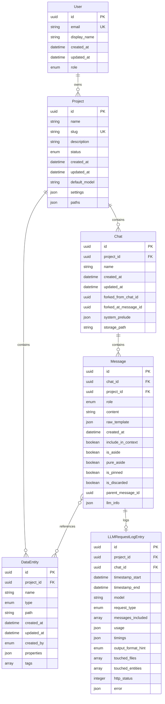
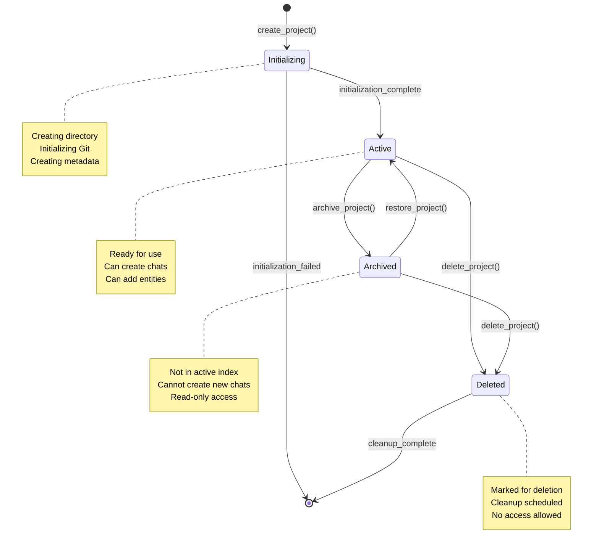

# Task Orchestrator Prompt

## Task Information
- **Task ID**: 0.2.5.1
- **Task Name**: Domain Model & State Refinement
- **Task Goal**: Refine domain.yaml with complete state transitions, invariants, relationships, and validation rules. Create state machine specifications and diagrams.

## Orchestrator Role

You are the orchestrator for this task. Your responsibilities:
1. Break down the task into manageable steps
2. Execute or delegate steps to specialized agents
3. Coordinate between different components
4. Ensure all requirements are met
5. Verify completion before finalizing

## Task Details

# Prompt 0.2.5.1: Domain Model & State Refinement

## Task Description
Refine the domain model and state specifications to provide complete detail for Phase 1-2 implementation. This includes expanding entity definitions, defining state machines, specifying invariants, and creating comprehensive diagrams.

## Context Gathering
Before starting, gather context using the doc_query tool:

```bash
# Get current domain specification
python3 tools/doc_query.py --query "spec/domain.yaml" --mode file --pretty

# Get state model from spec.yaml
python3 tools/doc_query.py --query "state_model" --mode text --pretty

# Get data model information
python3 tools/doc_query.py --query "data_model" --mode text --pretty

# Review Phase 1 and 2 requirements
python3 tools/doc_query.py --query "phase_1" --mode text --pretty
python3 tools/doc_query.py --query "phase_2" --mode text --pretty
```

## Requirements

### 1. Expand spec/domain.yaml

Add the following to each entity:

#### State Transitions
```yaml
entities:
  Project:
    # ... existing fields ...
    states:
      - name: initializing
        description: Project is being created
        transitions:
          - to: active
            trigger: initialization_complete
            guards:
              - git_repo_initialized
              - metadata_created
      
      - name: active
        description: Project is ready for use
        transitions:
          - to: archived
            trigger: archive_project
          - to: deleted
            trigger: delete_project
      
      - name: archived
        description: Project is archived but not deleted
        transitions:
          - to: active
            trigger: restore_project
          - to: deleted
            trigger: delete_project
      
      - name: deleted
        description: Project is marked for deletion
        transitions: []
```

#### Invariants
```yaml
entities:
  Project:
    # ... existing fields ...
    invariants:
      - "id is unique across all projects"
      - "name is unique within active projects"
      - "created_at <= updated_at"
      - "if status=deleted, project directory may not exist"
      - "if status=active, project directory must exist"
      - "if status=active, git repository must be initialized"
```

#### Relationships
```yaml
entities:
  Project:
    # ... existing fields ...
    relationships:
      - entity: Chat
        type: one_to_many
        cardinality: "1:N"
        description: "A project has zero or more chats"
        cascade_delete: true
      
      - entity: DataEntity
        type: one_to_many
        cardinality: "1:N"
        description: "A project has zero or more data entities"
        cascade_delete: true
```

#### Validation Rules
```yaml
entities:
  Project:
    # ... existing fields ...
    validation:
      name:
        - rule: "pattern"
          value: "^[a-zA-Z0-9_-]+$"
          message: "Name must contain only alphanumeric, underscore, and hyphen"
        - rule: "length"
          min: 1
          max: 100
          message: "Name must be between 1 and 100 characters"
      
      slug:
        - rule: "pattern"
          value: "^[a-z0-9-]+$"
          message: "Slug must be lowercase alphanumeric with hyphens"
        - rule: "unique"
          scope: "active_projects"
          message: "Slug must be unique among active projects"
```

### 2. Create State Machine Specifications

Create **spec/state_machines.yaml** with complete state machine definitions:

```yaml
version: 1.0.0
title: State Machine Specifications
description: |
  Formal state machine definitions for all stateful entities in the system.

state_machines:
  project_lifecycle:
    entity: Project
    initial_state: initializing
    
    states:
      initializing:
        description: "Project is being created"
        entry_actions:
          - create_directory
          - initialize_git
          - create_metadata
        exit_actions:
          - validate_structure
        invariants:
          - "directory exists"
          - "git repository initialized"
      
      active:
        description: "Project is ready for use"
        entry_actions:
          - add_to_index
          - emit_project_created_event
        invariants:
          - "in project index"
          - "directory exists"
          - "metadata valid"
      
      archived:
        description: "Project is archived"
        entry_actions:
          - remove_from_active_index
          - add_to_archive_index
        invariants:
          - "not in active index"
          - "in archive index"
      
      deleted:
        description: "Project is marked for deletion"
        entry_actions:
          - remove_from_all_indexes
          - schedule_cleanup
        exit_actions: []
        invariants:
          - "not in any index"
    
    transitions:
      - from: initializing
        to: active
        trigger: initialization_complete
        guards:
          - condition: "git_repo_initialized()"
            error: "Git repository not initialized"
          - condition: "metadata_exists()"
            error: "Project metadata not found"
        actions:
          - validate_project_structure
          - update_status
      
      - from: active
        to: archived
        trigger: archive_project
        guards:
          - condition: "no_active_chats()"
            error: "Cannot archive project with active chats"
        actions:
          - close_all_chats
          - update_status
      
      - from: active
        to: deleted
        trigger: delete_project
        guards:
          - condition: "user_confirmed()"
            error: "User confirmation required"
        actions:
          - mark_for_deletion
          - schedule_cleanup
      
      - from: archived
        to: active
        trigger: restore_project
        guards:
          - condition: "directory_exists()"
            error: "Project directory not found"
        actions:
          - validate_structure
          - update_status
      
      - from: archived
        to: deleted
        trigger: delete_project
        guards:
          - condition: "user_confirmed()"
            error: "User confirmation required"
        actions:
          - mark_for_deletion
          - schedule_cleanup
```

### 3. Create Mermaid Diagrams

Create **docs/diagrams/domain_model.mmd**:



Create **docs/diagrams/state_machine.mmd**:



## Expected Outputs

1. **spec/domain.yaml** - Enhanced with:
   - State transitions for all entities
   - Invariants for all entities
   - Detailed relationships with cardinalities
   - Validation rules for all fields

2. **spec/state_machines.yaml** - New file with:
   - Complete state machine definitions
   - Entry/exit actions
   - Transition guards and actions
   - State invariants

3. **docs/diagrams/domain_model.mmd** - Entity relationship diagram

4. **docs/diagrams/state_machine.mmd** - State machine diagram for Project lifecycle

5. **docs/diagrams/chat_state_machine.mmd** - State machine diagram for Chat lifecycle

6. **docs/diagrams/message_state_machine.mmd** - State machine diagram for Message lifecycle

## Verification Steps

1. Validate all YAML files:
   ```bash
   python3 verify/validate_yaml.py
   ```

2. Check that all entity states are defined

3. Verify all state transitions have guards and actions

4. Ensure all relationships are bidirectional where appropriate

5. Validate that invariants are checkable (can be implemented as code)

6. Render Mermaid diagrams to verify syntax:
   ```bash
   # Use mermaid-cli or online editor
   mmdc -i docs/diagrams/domain_model.mmd -o docs/diagrams/domain_model.png
   ```

## Notes

- Focus on Phase 1-2 entities (Project, Chat, Message, DataEntity)
- User entity is for Phase 4+, keep minimal for now
- State machines should be implementable as code
- Invariants should be checkable at runtime
- All diagrams should be in Mermaid format for easy editing

## Prompt Guidance (Orchestrator Scope)

### Task Execution Guidelines
- **Deterministic Methods**: Use Python code for tasks when possible and practical
- **Documentation**: Create task summary in log/task_0.2.5.1_summary.yaml
- **Review Previous Work**: Check log/task_{previous_task_id}_notes.yaml for context
- **Justification**: Provide clear justification for each step in the summary
- **Error Handling**: If errors occur, document in ./open_questions.yaml
- **Verification**: Create verification scripts in ./verify/ when possible
- **Manual Updates**: Keep system documentation (./man/*.yaml) up to date
- **Spec Consistency**: Verify spec file references when modifying specs
- **Clean Repository**: Remove temporary files when task is complete
- **Scope Control**: Stay within task scope; ask questions if unclear
- **Commit and Push**: ALWAYS commit and push after completing a task

### File Organization
- Task summaries: `log/task_0.2.5.1_summary.yaml`
- Task notes: `log/task_0.2.5.1_notes.yaml` (if needed)
- Verification scripts: `verify/task_0.2.5.1_*.py`
- System manuals: `man/system_manual.yaml`, `man/user_manual.yaml`

### Completion Criteria
Before marking a task complete:
1. All task steps completed
2. All deliverables created
3. Tests passing (if applicable)
4. Documentation updated
5. Task moved from master_todo.yaml to log/tasks_completed.yaml
6. Task summary created in log/
7. Repository committed and pushed

## Context Gathering

Use the doc_query tool to gather relevant context:

```bash
# Get complete task information
python3 tools/doc_query.py --query &quot;0.2.5.1&quot; --mode task --pretty

# Get related specification files
python3 tools/doc_query.py --query &quot;spec/domain.yaml&quot; --mode file --pretty
python3 tools/doc_query.py --query &quot;spec/state_machines.yaml&quot; --mode file --pretty
python3 tools/doc_query.py --query &quot;docs/diagrams/domain_model.mmd&quot; --mode file --pretty
python3 tools/doc_query.py --query &quot;docs/diagrams/state_machine.mmd&quot; --mode file --pretty

# Example: Find tasks by name pattern
python3 tools/doc_query.py --query &quot;current[*].task.{name~pattern}&quot; --mode path --pretty

# Example: Find tasks with specific status
python3 tools/doc_query.py --query &quot;current[*].task.{status=active}&quot; --mode path --pretty

# Example: Complex predicate query
python3 tools/doc_query.py --query &quot;current[*].task.{name~Frontend AND priority>3}&quot; --mode path --pretty

# Search for specific keywords
python3 tools/doc_query.py --query &quot;keyword*&quot; --mode text --pretty

```

### Additional Query Examples

```bash
# Legacy path query (still supported)
python3 tools/doc_query.py --query "current[*].task.id=0.2" --mode path --pretty

# Search for specific content
python3 tools/doc_query.py --query "search term" --mode text --pretty

# Find related files by topic
python3 tools/doc_query.py --query "spec/spec.yaml" --mode related --pretty
```

## Task Execution Steps

{execution_steps}

## Expected Outputs

{expected_outputs}

## Verification

{verification_steps}

## Agent Delegation (If Needed)

If this task requires specialized agents:

1. **Create agent prompts** in `prompts/agents/task_0.2.5.1/`
2. **Agent scope**: Each agent should have:
   - Clear, narrow objective
   - Specific input/output requirements
   - Verification criteria
   - Limited prompt guidance (only relevant to their scope)

3. **Agent coordination**:
   - Execute agents in sequence
   - Pass outputs between agents
   - Verify each agent's work before proceeding
   - Aggregate results

## Files Referenced

{files_referenced}

## Next Steps After Completion

1. Run task cleanup tool:
   ```bash
   python3 tools/task_cleanup.py --task-id 0.2.5.1
   ```

2. If cleanup finds issues, repair and re-run

3. Once cleanup passes, the task is complete