# Task Orchestrator Prompt

## Task Information
- **Task ID**: 0.2.5.2
- **Task Name**: Module Specification Creation
- **Task Goal**: Create detailed module specifications for all 5 core modules following the module_spec_schema.yaml.

## Orchestrator Role

You are the orchestrator for this task. Your responsibilities:
1. Break down the task into manageable steps
2. Execute or delegate steps to specialized agents
3. Coordinate between different components
4. Ensure all requirements are met
5. Verify completion before finalizing

## Task Details

# Prompt 0.2.5.2: Module Specification Creation

## Task Description
Create detailed module specifications for all 5 core modules using the module_spec_schema.yaml. Each module gets its own YAML file with complete details about responsibilities, dependencies, functions, and implementation guidance.

## Context Gathering
```bash
python3 tools/doc_query.py --query "spec/spec.yaml" --mode file --pretty | grep -A 50 "modules"
python3 tools/doc_query.py --query "spec/schemas/module_spec_schema.yaml" --mode file --pretty
python3 tools/doc_query.py --query "phase_1" --mode text --pretty
python3 tools/doc_query.py --query "phase_2" --mode text --pretty
```

## Requirements

Create 5 module specification files following spec/schemas/module_spec_schema.yaml:

### 1. spec/modules/frontend_svelte.yaml
- Complete module specification for Svelte frontend
- List all major components and their responsibilities
- Define data flow from backend APIs
- Specify state management approach
- List all functions (component methods, utilities)
- Include LLM guidance for Svelte/Tailwind implementation

### 2. spec/modules/backend_node.yaml
- Complete module specification for Node.js backend
- List all API endpoints (reference to apis.yaml)
- Define service layer functions
- Specify data access patterns
- Define OpenRouter integration functions
- Include LLM guidance for Fastify implementation

### 3. spec/modules/backend_python_tools.yaml
- Complete module specification for Python tools backend
- List all tool endpoints
- Define Jinja2 template rendering functions
- Specify code execution sandbox approach
- Include LLM guidance for FastAPI implementation

### 4. spec/modules/git_integration.yaml
- Complete module specification for Git operations
- List all Git functions (init, commit, push, status, diff)
- Define auto-commit batching logic
- Specify conflict resolution approach
- Include LLM guidance for simple-git usage

### 5. spec/modules/logging_and_metrics.yaml
- Complete module specification for logging
- Define log entry types and schemas
- Specify log storage and retrieval
- Define metrics collection approach
- Include LLM guidance for structured logging

## Module Dependencies Diagram

Create **docs/diagrams/module_dependencies.mmd**:

```mermaid
graph TD
    FE[Frontend Svelte]
    BN[Backend Node]
    BP[Backend Python Tools]
    GI[Git Integration]
    LM[Logging & Metrics]
    
    FE -->|REST API| BN
    BN -->|Tool Calls| BP
    BN -->|Git Ops| GI
    BN -->|Log Events| LM
    BP -->|Log Events| LM
    GI -->|Log Events| LM
    
    BN -->|OpenRouter| OR[OpenRouter API]
    GI -->|Git Commands| GIT[Git CLI]
    
    style FE fill:#4a5568
    style BN fill:#2d3748
    style BP fill:#1a202c
    style GI fill:#2c5282
    style LM fill:#2b6cb0
```



## Expected Outputs

1. **spec/modules/frontend_svelte.yaml** - Complete module spec
2. **spec/modules/backend_node.yaml** - Complete module spec
3. **spec/modules/backend_python_tools.yaml** - Complete module spec
4. **spec/modules/git_integration.yaml** - Complete module spec
5. **spec/modules/logging_and_metrics.yaml** - Complete module spec
6. **docs/diagrams/module_dependencies.mmd** - Module dependency diagram

## Verification Steps

1. Validate all module specs against schema:
   ```bash
   python3 verify/validate_module_specs.py
   ```

2. Check that all module dependencies are valid references

3. Verify all functions listed have clear purposes

4. Ensure LLM guidance is comprehensive

5. Render module dependency diagram

## Notes

- Each module spec should be 200-400 lines
- Focus on Phase 1-2 functionality
- Include clear boundaries (in-scope/out-of-scope)
- List all significant functions (detailed specs come in next task)
- Provide actionable LLM guidance

## Prompt Guidance (Orchestrator Scope)

### Task Execution Guidelines
- **Deterministic Methods**: Use Python code for tasks when possible and practical
- **Documentation**: Create task summary in log/task_0.2.5.2_summary.yaml
- **Review Previous Work**: Check log/task_{previous_task_id}_notes.yaml for context
- **Justification**: Provide clear justification for each step in the summary
- **Error Handling**: If errors occur, document in ./open_questions.yaml
- **Verification**: Create verification scripts in ./verify/ when possible
- **Manual Updates**: Keep system documentation (./man/*.yaml) up to date
- **Spec Consistency**: Verify spec file references when modifying specs
- **Clean Repository**: Remove temporary files when task is complete
- **Scope Control**: Stay within task scope; ask questions if unclear
- **Commit and Push**: ALWAYS commit and push after completing a task

### File Organization
- Task summaries: `log/task_0.2.5.2_summary.yaml`
- Task notes: `log/task_0.2.5.2_notes.yaml` (if needed)
- Verification scripts: `verify/task_0.2.5.2_*.py`
- System manuals: `man/system_manual.yaml`, `man/user_manual.yaml`

### Completion Criteria
Before marking a task complete:
1. All task steps completed
2. All deliverables created
3. Tests passing (if applicable)
4. Documentation updated
5. Task moved from master_todo.yaml to log/tasks_completed.yaml
6. Task summary created in log/
7. Repository committed and pushed

## Context Gathering

Use the doc_query tool to gather relevant context:

```bash
# Get complete task information
python3 tools/doc_query.py --query &quot;0.2.5.2&quot; --mode task --pretty

# Get related specification files
python3 tools/doc_query.py --query &quot;spec/modules/frontend_svelte.yaml&quot; --mode file --pretty
python3 tools/doc_query.py --query &quot;spec/modules/backend_node.yaml&quot; --mode file --pretty
python3 tools/doc_query.py --query &quot;spec/modules/backend_python_tools.yaml&quot; --mode file --pretty
python3 tools/doc_query.py --query &quot;spec/modules/git_integration.yaml&quot; --mode file --pretty
python3 tools/doc_query.py --query &quot;spec/modules/logging_and_metrics.yaml&quot; --mode file --pretty
python3 tools/doc_query.py --query &quot;docs/diagrams/module_dependencies.mmd&quot; --mode file --pretty

# Example: Find tasks by name pattern
python3 tools/doc_query.py --query &quot;current[*].task.{name~pattern}&quot; --mode path --pretty

# Example: Find tasks with specific status
python3 tools/doc_query.py --query &quot;current[*].task.{status=active}&quot; --mode path --pretty

# Example: Complex predicate query
python3 tools/doc_query.py --query &quot;current[*].task.{name~Frontend AND priority>3}&quot; --mode path --pretty

# Search for specific keywords
python3 tools/doc_query.py --query &quot;keyword*&quot; --mode text --pretty

```

### Additional Query Examples

```bash
# Legacy path query (still supported)
python3 tools/doc_query.py --query "current[*].task.id=0.2" --mode path --pretty

# Search for specific content
python3 tools/doc_query.py --query "search term" --mode text --pretty

# Find related files by topic
python3 tools/doc_query.py --query "spec/spec.yaml" --mode related --pretty
```

## Task Execution Steps

{execution_steps}

## Expected Outputs

{expected_outputs}

## Verification

{verification_steps}

## Agent Delegation (If Needed)

If this task requires specialized agents:

1. **Create agent prompts** in `prompts/agents/task_0.2.5.2/`
2. **Agent scope**: Each agent should have:
   - Clear, narrow objective
   - Specific input/output requirements
   - Verification criteria
   - Limited prompt guidance (only relevant to their scope)

3. **Agent coordination**:
   - Execute agents in sequence
   - Pass outputs between agents
   - Verify each agent's work before proceeding
   - Aggregate results

## Files Referenced

{files_referenced}

## Next Steps After Completion

1. Run task cleanup tool:
   ```bash
   python3 tools/task_cleanup.py --task-id 0.2.5.2
   ```

2. If cleanup finds issues, repair and re-run

3. Once cleanup passes, the task is complete