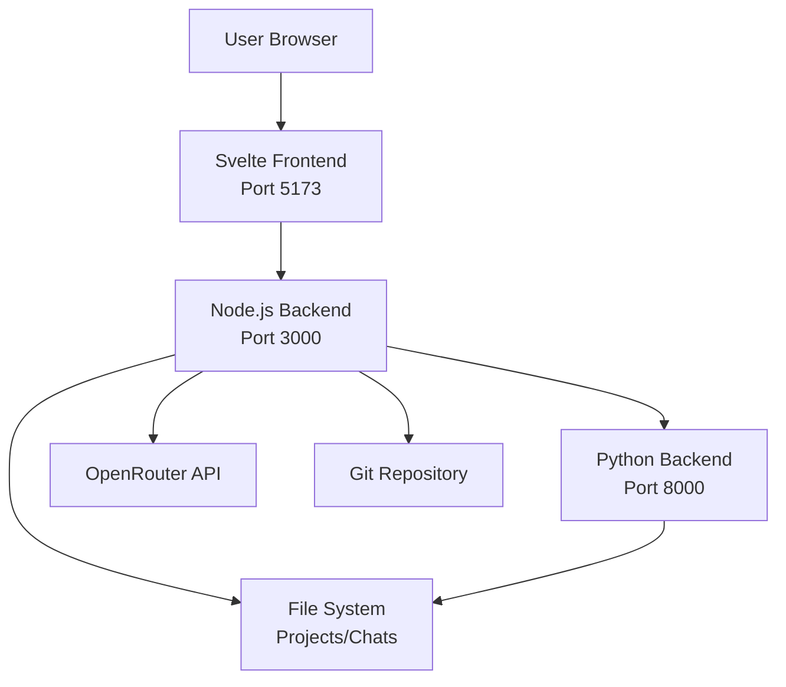
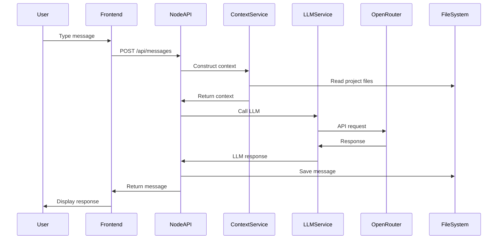
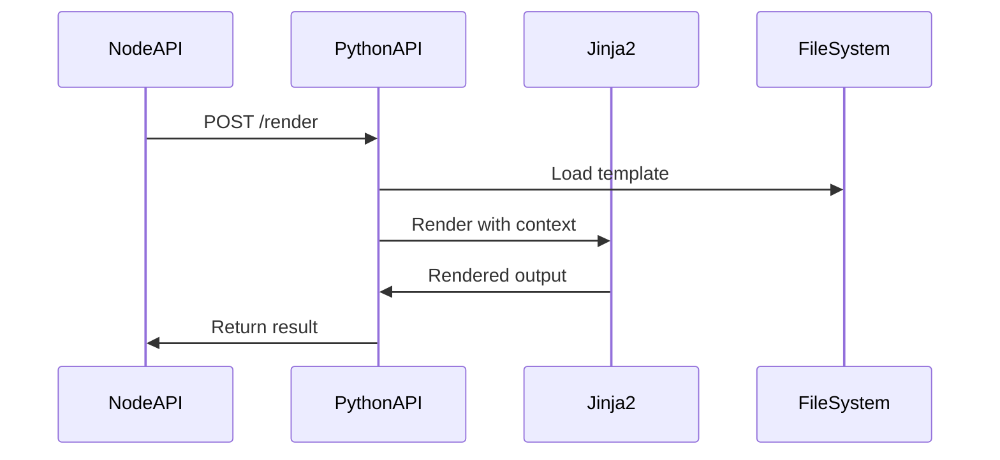

# Task Orchestrator Prompt

## Task Information
- **Task ID**: 0.9
- **Task Name**: Create Documentation and Initialize Git
- **Task Goal**: Create comprehensive documentation and initialize Git repository.

## Orchestrator Role

You are the orchestrator for this task. Your responsibilities:
1. Break down the task into manageable steps
2. Execute or delegate steps to specialized agents
3. Coordinate between different components
4. Ensure all requirements are met
5. Verify completion before finalizing

## Task Details

# Prompt 0.9: Create Documentation and Initialize Git Repository

## Task Description
Create comprehensive project documentation including README.md, CONTRIBUTING.md, ARCHITECTURE.md, API documentation, and initialize Git repository with proper configuration. Perform final Phase 0 verification.

## Context Gathering
Before starting, gather context using the doc_query tool:

```bash
# Get all specification files for documentation (PRIMARY REFERENCES)
python3 tools/doc_query.py --query "spec/spec.yaml" --mode file --pretty
python3 tools/doc_query.py --query "spec/domain.yaml" --mode file --pretty
python3 tools/doc_query.py --query "spec/apis.yaml" --mode file --pretty
python3 tools/doc_query.py --query "spec/workflows.yaml" --mode file --pretty

# Get module specifications
python3 tools/doc_query.py --query "spec/modules" --mode text --pretty

# Get function specifications
python3 tools/doc_query.py --query "spec/functions" --mode text --pretty

# Review completed tasks
python3 tools/doc_query.py --query "tasks_completed" --mode text --pretty
```

## Requirements

### Documentation Files to Create

1. **README.md** (Root) - Project overview and quick start
2. **CONTRIBUTING.md** - Contribution guidelines
3. **docs/ARCHITECTURE.md** - System architecture
4. **docs/API.md** - API documentation
5. **docs/DEVELOPMENT.md** - Development guide
6. **docs/CONFIGURATION.md** - Already created in task 0.6
7. **docs/TESTING.md** - Already created in task 0.8
8. **docs/DEPLOYMENT.md** - Deployment guide

### Git Configuration Files

1. **.gitignore** - Comprehensive ignore rules
2. **.gitattributes** - Line ending configuration
3. **.editorconfig** - Editor configuration

### Verification

1. **verify/verify_phase_0.py** - Phase 0 verification script
2. **log/phase_0_completion.yaml** - Completion summary

## Steps to Complete

### 1. Create Root README.md

```markdown
# OinkerUI

An LLM-assisted development workbench that provides an interactive chat interface for building software projects with AI assistance.

## Overview

OinkerUI is a full-stack application that combines:
- **Svelte Frontend**: Modern, reactive UI with Tailwind CSS
- **Node.js Backend**: Fastify-based API server with OpenRouter integration
- **Python Tools**: FastAPI service for Jinja2 rendering and code execution
- **Git Integration**: Automatic version control for all projects

## Features

- 🤖 **LLM Integration**: Chat with AI assistants via OpenRouter
- 💬 **Multi-Chat Support**: Multiple conversation threads per project
- 🔄 **Context Management**: Intelligent context construction from project files
- 📝 **Template System**: Jinja2 templates for code generation
- 🔧 **Code Execution**: Sandboxed Python code execution
- 📦 **Git Integration**: Automatic commits and version tracking
- 🎨 **Modern UI**: Clean, responsive interface built with Svelte

## Quick Start

### Prerequisites

- Node.js 18+ and npm
- Python 3.9+
- Git
- OpenRouter API key

### Installation

```bash
# Clone the repository
git clone https://github.com/yourusername/oinkerui.git
cd oinkerui

# Run setup script
npm run setup

# Configure environment
cp .env.example .env
# Edit .env and add your OPENROUTER_API_KEY
```

### Development

```bash
# Start all services (frontend + Node.js + Python)
npm run dev

# Or start services individually
npm run dev:frontend  # http://localhost:5173
npm run dev:backend   # http://localhost:3000
npm run dev:python    # http://localhost:8000
```

### Building for Production

```bash
npm run build
```

## Documentation

- [Architecture](docs/ARCHITECTURE.md) - System design and components
- [API Documentation](docs/API.md) - REST API reference
- [Development Guide](docs/DEVELOPMENT.md) - Setup and development workflow
- [Configuration](docs/CONFIGURATION.md) - Environment configuration
- [Testing](docs/TESTING.md) - Testing guide
- [Deployment](docs/DEPLOYMENT.md) - Deployment instructions
- [Contributing](CONTRIBUTING.md) - Contribution guidelines

## Project Structure

```
oinkerui/
├── frontend/           # Svelte frontend application
├── backend/            # Node.js backend (Fastify)
├── backend_python/     # Python tools backend (FastAPI)
├── spec/               # Specification documents
├── docs/               # Documentation
├── scripts/            # Build and utility scripts
├── tests/              # Integration tests
└── tools/              # Development tools
```

## Technology Stack

### Frontend
- Svelte 4 - Component framework
- Vite 5 - Build tool
- Tailwind CSS 3 - Styling
- Marked - Markdown rendering
- Highlight.js - Syntax highlighting

### Backend (Node.js)
- Fastify 4 - Web framework
- simple-git - Git operations
- axios - HTTP client
- tiktoken - Token counting

### Backend (Python)
- FastAPI - Web framework
- Jinja2 - Template engine
- uvicorn - ASGI server

## License

[Your License Here]

## Acknowledgments

Built with modern web technologies and powered by OpenRouter's LLM API.
```

### 2. Create CONTRIBUTING.md

```markdown
# Contributing to OinkerUI

Thank you for your interest in contributing to OinkerUI! This document provides guidelines and instructions for contributing.

## Development Setup

1. Fork and clone the repository
2. Run `npm run setup` to install dependencies
3. Copy `.env.example` to `.env` and configure
4. Run `npm run dev` to start development servers

## Development Workflow

1. Create a feature branch: `git checkout -b feature/your-feature`
2. Make your changes
3. Write/update tests
4. Run tests: `npm test`
5. Run linters: `npm run lint`
6. Format code: `npm run format`
7. Commit with descriptive message
8. Push and create a pull request

## Coding Standards

### JavaScript/Svelte
- Use ESLint configuration provided
- Format with Prettier
- Use meaningful variable names
- Add JSDoc comments for functions
- Follow Svelte best practices

### Python
- Follow PEP 8 style guide
- Use Black for formatting
- Use type hints
- Add docstrings for functions
- Maximum line length: 100

### Commit Messages
- Use present tense: "Add feature" not "Added feature"
- Use imperative mood: "Move cursor to..." not "Moves cursor to..."
- Reference issues: "Fix #123: Description"
- Keep first line under 72 characters

## Testing Requirements

- Write unit tests for new functions
- Write integration tests for new features
- Ensure all tests pass before submitting PR
- Maintain or improve code coverage

## Pull Request Process

1. Update documentation for any changed functionality
2. Add tests for new features
3. Ensure all tests pass
4. Update CHANGELOG.md if applicable
5. Request review from maintainers
6. Address review feedback
7. Squash commits if requested

## Code Review Guidelines

- Be respectful and constructive
- Focus on code, not the person
- Explain reasoning for suggestions
- Be open to discussion
- Approve when satisfied

## Reporting Issues

- Use issue templates
- Provide clear description
- Include steps to reproduce
- Add relevant logs/screenshots
- Specify environment details

## Questions?

Feel free to open an issue for questions or join our community discussions.
```

### 3. Create docs/ARCHITECTURE.md

```markdown
# OinkerUI Architecture

## System Overview

OinkerUI is a three-tier application consisting of:
1. **Frontend**: Svelte-based UI
2. **Node.js Backend**: Primary API server
3. **Python Backend**: Tools and execution services



## Component Architecture

### Frontend (Svelte)

**Location**: `frontend/`

**Responsibilities**:
- User interface rendering
- User interaction handling
- State management (Svelte stores)
- API communication
- Markdown rendering with syntax highlighting

**Key Components**:
- `Header.svelte` - Application header
- `Sidebar.svelte` - Project/chat navigation
- `ChatInterface.svelte` - Main chat interface
- `MessageList.svelte` - Message display
- `MessageInput.svelte` - User input
- `WorkspacePanel.svelte` - File browser

**State Management**:
- `projectStore.js` - Project state
- `chatStore.js` - Chat and message state
- `uiStore.js` - UI state (sidebar, modals)

### Node.js Backend (Fastify)

**Location**: `backend/`

**Responsibilities**:
- REST API endpoints
- Business logic
- LLM integration (OpenRouter)
- Context construction
- Git operations
- File-based data persistence
- Coordination with Python backend

**Architecture**:
```
backend/
├── src/
│   ├── index.js           # Entry point
│   ├── routes/            # API route handlers
│   │   ├── projects.js
│   │   ├── chats.js
│   │   ├── messages.js
│   │   └── git.js
│   ├── services/          # Business logic
│   │   ├── projectService.js
│   │   ├── chatService.js
│   │   ├── contextService.js
│   │   ├── llmService.js
│   │   └── gitService.js
│   └── data/              # Data access
│       ├── projectStore.js
│       ├── chatStore.js
│       └── configStore.js
```

**Key Services**:
- **ProjectService**: Project CRUD operations
- **ChatService**: Chat and message management
- **ContextService**: Context construction algorithm
- **LLMService**: OpenRouter API integration
- **GitService**: Git operations wrapper

### Python Backend (FastAPI)

**Location**: `backend_python/`

**Responsibilities**:
- Jinja2 template rendering
- Code execution (sandboxed)
- Token counting
- File operations

**Architecture**:
```
backend_python/
├── src/
│   ├── main.py            # Entry point
│   ├── routes/            # API routes
│   │   ├── render.py
│   │   └── execute.py
│   ├── services/          # Business logic
│   │   ├── template_service.py
│   │   └── execution_service.py
│   └── utils/             # Utilities
│       └── sandbox.py
├── templates/             # Jinja2 templates
└── sandboxes/             # Execution environments
```

## Data Flow

### Message Send Flow



### Template Rendering Flow



## Data Storage

### File-Based Storage

**Projects**: `workspaces/{project_id}/`
```
project_id/
├── project.json          # Project metadata
├── chats/                # Chat data
│   ├── chat_1.jsonl      # Message log
│   └── chat_2.jsonl
├── data/                 # Project data
└── .git/                 # Git repository
```

**Project Metadata** (`project.json`):
```json
{
  "id": "proj-uuid",
  "name": "Project Name",
  "description": "Description",
  "created_at": "ISO timestamp",
  "status": "active",
  "workspace_path": "/path/to/workspace"
}
```

**Chat Messages** (JSONL format):
```jsonl
{"id":"msg-1","role":"user","content":"Hello","timestamp":"..."}
{"id":"msg-2","role":"assistant","content":"Hi!","timestamp":"..."}
```

## Security Considerations

### Current (Phase 1-3)
- No authentication (local use only)
- File system access restricted to workspace directories
- Code execution sandboxed (Python backend)
- Input validation on all endpoints
- CORS configured for local development

### Future (Phase 4+)
- User authentication with Supabase
- Row-level security
- API rate limiting
- Enhanced sandboxing
- Audit logging

## Scalability Considerations

### Current Limitations
- File-based storage (single machine)
- No horizontal scaling
- Limited concurrent users

### Future Improvements (Phase 4+)
- Database migration (Supabase)
- Stateless backend design
- Load balancing support
- Caching layer (Redis)
- Message queue for async tasks

## Technology Decisions

### Why Fastify?
- High performance
- Excellent TypeScript support
- Rich plugin ecosystem
- Built-in validation

### Why Svelte?
- Minimal bundle size
- True reactivity
- Simple syntax
- Great developer experience

### Why FastAPI (Python)?
- Modern async support
- Automatic API documentation
- Type validation with Pydantic
- Easy integration with Python libraries

### Why File-Based Storage?
- Simple for Phase 1-3
- No database setup required
- Easy to understand and debug
- Git-friendly for version control

## References

- [Module Specifications](../spec/modules/)
- [Function Specifications](../spec/functions/)
- [API Specifications](../spec/apis.yaml)
- [Domain Model](../spec/domain.yaml)
```

### 4. Create docs/API.md

```markdown
# API Documentation

## Base URLs

- **Node.js API**: `http://localhost:3000/api`
- **Python Tools**: `http://localhost:8000`

## Authentication

Phase 1-3: No authentication required (local use)
Phase 4+: JWT-based authentication

## Node.js API Endpoints

### Projects

#### List Projects
```http
GET /api/projects
```

**Response**:
```json
[
  {
    "id": "proj-uuid",
    "name": "Project Name",
    "description": "Description",
    "created_at": "2024-01-20T10:00:00Z",
    "status": "active"
  }
]
```

#### Create Project
```http
POST /api/projects
Content-Type: application/json

{
  "name": "New Project",
  "description": "Project description"
}
```

**Response**: `201 Created`
```json
{
  "id": "proj-uuid",
  "name": "New Project",
  "description": "Project description",
  "created_at": "2024-01-20T10:00:00Z",
  "status": "active",
  "workspace_path": "/path/to/workspace"
}
```

#### Get Project
```http
GET /api/projects/:projectId
```

#### Update Project
```http
PUT /api/projects/:projectId
Content-Type: application/json

{
  "name": "Updated Name",
  "description": "Updated description"
}
```

#### Delete Project
```http
DELETE /api/projects/:projectId
```

### Chats

#### List Chats
```http
GET /api/projects/:projectId/chats
```

#### Create Chat
```http
POST /api/projects/:projectId/chats
Content-Type: application/json

{
  "name": "New Chat"
}
```

#### Get Chat
```http
GET /api/projects/:projectId/chats/:chatId
```

### Messages

#### List Messages
```http
GET /api/projects/:projectId/chats/:chatId/messages
```

#### Send Message
```http
POST /api/projects/:projectId/chats/:chatId/messages
Content-Type: application/json

{
  "content": "User message",
  "role": "user"
}
```

**Response**: `201 Created`
```json
{
  "id": "msg-uuid",
  "role": "assistant",
  "content": "AI response",
  "timestamp": "2024-01-20T10:00:00Z"
}
```

### Git Operations

#### Initialize Repository
```http
POST /api/projects/:projectId/git/init
```

#### Get Status
```http
GET /api/projects/:projectId/git/status
```

#### Commit Changes
```http
POST /api/projects/:projectId/git/commit
Content-Type: application/json

{
  "message": "Commit message"
}
```

## Python Tools API

### Template Rendering

#### Render Template
```http
POST /render
Content-Type: application/json

{
  "template": "Hello {{ name }}!",
  "context": {
    "name": "World"
  }
}
```

**Response**:
```json
{
  "result": "Hello World!"
}
```

### Code Execution

#### Execute Code
```http
POST /execute
Content-Type: application/json

{
  "code": "print('Hello')",
  "language": "python"
}
```

**Response**:
```json
{
  "output": "Hello\n",
  "error": null,
  "exit_code": 0
}
```

## Error Responses

All endpoints return errors in this format:

```json
{
  "error": {
    "code": "ERROR_CODE",
    "message": "Human-readable message",
    "details": {}
  }
}
```

### Common Error Codes

- `400` - Bad Request (invalid input)
- `404` - Not Found (resource doesn't exist)
- `500` - Internal Server Error
- `503` - Service Unavailable (OpenRouter API down)

## Rate Limiting

Phase 1-3: No rate limiting
Phase 4+: 100 requests per minute per user

## Webhooks

Phase 4+: Webhook support for async operations

## API Versioning

Current version: v1 (implicit in URL)
Future: `/api/v2/...` for breaking changes
```

### 5. Create docs/DEVELOPMENT.md

```markdown
# Development Guide

## Prerequisites

- **Node.js**: 18.0.0 or higher
- **Python**: 3.9 or higher
- **npm**: 9.0.0 or higher
- **Git**: 2.30.0 or higher
- **OpenRouter API Key**: Required for LLM functionality

## Initial Setup

### 1. Clone Repository

```bash
git clone https://github.com/yourusername/oinkerui.git
cd oinkerui
```

### 2. Run Setup Script

```bash
npm run setup
```

This will:
- Install Node.js dependencies
- Install frontend dependencies
- Create Python virtual environment
- Install Python dependencies
- Create `.env` from `.env.example`
- Create workspace directories

### 3. Configure Environment

Edit `.env` and set your OpenRouter API key:

```env
OPENROUTER_API_KEY=your-api-key-here
```

## Running the Application

### Start All Services

```bash
npm run dev
```

This starts:
- Frontend dev server on http://localhost:5173
- Node.js backend on http://localhost:3000
- Python tools on http://localhost:8000

### Start Individual Services

```bash
# Frontend only
npm run dev:frontend

# Node.js backend only
npm run dev:backend

# Python backend only
npm run dev:python
```

## Development Workflow

### Making Changes

1. Create a feature branch
2. Make your changes
3. Test your changes
4. Run linters and formatters
5. Commit and push

### Testing

```bash
# Run all tests
npm test

# Run specific test suites
npm run test:frontend
npm run test:backend
npm run test:python

# Watch mode (frontend)
cd frontend && npm run test:watch

# Coverage reports
npm run test:coverage
```

### Linting and Formatting

```bash
# Run all linters
npm run lint

# Format all code
npm run format

# Fix linting issues
npm run lint:fix
```

## Project Structure

```
oinkerui/
├── frontend/              # Svelte frontend
│   ├── src/
│   │   ├── lib/
│   │   │   ├── components/  # UI components
│   │   │   ├── stores/      # State management
│   │   │   └── utils/       # Utilities
│   │   ├── App.svelte
│   │   └── main.js
│   └── tests/             # Frontend tests
│
├── backend/               # Node.js backend
│   ├── src/
│   │   ├── routes/        # API routes
│   │   ├── services/      # Business logic
│   │   └── data/          # Data access
│   └── tests/             # Backend tests
│
├── backend_python/        # Python backend
│   ├── src/
│   │   ├── routes/        # API routes
│   │   ├── services/      # Business logic
│   │   └── utils/         # Utilities
│   └── tests/             # Python tests
│
├── spec/                  # Specifications
│   ├── modules/           # Module specs
│   ├── functions/         # Function specs
│   └── *.yaml             # Domain, API, UI specs
│
├── docs/                  # Documentation
├── scripts/               # Build scripts
└── tools/                 # Development tools
```

## Common Tasks

### Adding a New API Endpoint

1. Add route handler in `backend/src/routes/`
2. Implement business logic in `backend/src/services/`
3. Add tests in `backend/tests/`
4. Update API documentation in `docs/API.md`

### Adding a New Component

1. Create component in `frontend/src/lib/components/`
2. Add tests in `frontend/tests/unit/`
3. Import and use in parent component

### Adding a New Function Spec

1. Create YAML file in `spec/functions/{module}/`
2. Follow function spec schema
3. Run verification: `python3 verify/verify_all_specs.py`

## Debugging

### Frontend Debugging

- Use browser DevTools
- Check console for errors
- Use Svelte DevTools extension
- Check network tab for API calls

### Backend Debugging

**Node.js**:
```bash
# Start with debugger
node --inspect backend/src/index.js

# Or use VS Code debugger
```

**Python**:
```bash
# Start with debugger
python -m pdb backend_python/src/main.py

# Or use VS Code debugger
```

### Common Issues

**Port already in use**:
```bash
# Find and kill process
lsof -ti:3000 | xargs kill -9
```

**Dependencies out of sync**:
```bash
# Reinstall all dependencies
npm run clean
npm run setup
```

**Python virtual environment issues**:
```bash
# Recreate virtual environment
rm -rf venv
python3 -m venv venv
source venv/bin/activate
pip install -r requirements.txt
```

## Building for Production

```bash
npm run build
```

This creates:
- `frontend/dist/` - Production frontend build
- Backend files remain in `backend/src/`
- Python files remain in `backend_python/src/`

## Environment Variables

See [Configuration Guide](CONFIGURATION.md) for complete list.

## Tools and Utilities

### Document Query Tool

```bash
# Query specifications
python3 tools/doc_query.py --query "domain" --mode text --pretty

# Get task information
python3 tools/doc_query.py --query "0.3.5" --mode task --pretty
```

### Verification Scripts

```bash
# Validate all YAML files
python3 verify/validate_yaml.py

# Check spec references
python3 verify/check_spec_references.py

# Verify Phase 0 setup
python3 verify/verify_phase_0.py
```

## Getting Help

- Check [Architecture](ARCHITECTURE.md) for system design
- Check [API Documentation](API.md) for endpoint details
- Check [Testing Guide](TESTING.md) for testing help
- Open an issue on GitHub
```

### 6. Create docs/DEPLOYMENT.md

```markdown
# Deployment Guide

## Overview

OinkerUI can be deployed in several ways depending on your needs.

## Local Deployment

For personal use on a single machine.

### Prerequisites
- Node.js 18+
- Python 3.9+
- Git

### Steps

1. Clone and setup:
```bash
git clone https://github.com/yourusername/oinkerui.git
cd oinkerui
npm run setup
```

2. Configure `.env` with production values

3. Build frontend:
```bash
npm run build
```

4. Start services:
```bash
# Node.js backend (serves frontend)
node backend/src/index.js

# Python backend
cd backend_python && python src/main.py
```

## Docker Deployment

Coming in Phase 4+

## Cloud Deployment

Coming in Phase 4+

## Environment Configuration

### Production Environment Variables

```env
NODE_ENV=production
NODE_PORT=3000
PYTHON_PORT=8000
OPENROUTER_API_KEY=your-production-key
LOG_LEVEL=warn
DEBUG=false
```

## Security Checklist

- [ ] Change SECRET_KEY from default
- [ ] Set strong OPENROUTER_API_KEY
- [ ] Configure CORS_ORIGINS for your domain
- [ ] Enable HTTPS
- [ ] Set up firewall rules
- [ ] Regular backups of workspace data
- [ ] Monitor logs for errors

## Monitoring

### Logs

- Node.js logs: Check console output
- Python logs: Check console output
- Application logs: `logs/` directory

### Health Checks

- Node.js: `GET http://localhost:3000/api/health`
- Python: `GET http://localhost:8000/health`

## Backup and Recovery

### Backup

```bash
# Backup workspace data
tar -czf backup-$(date +%Y%m%d).tar.gz workspaces/ data/
```

### Recovery

```bash
# Restore from backup
tar -xzf backup-20240120.tar.gz
```

## Troubleshooting

### Service Won't Start

1. Check logs for errors
2. Verify environment variables
3. Check port availability
4. Verify dependencies installed

### Performance Issues

1. Check OpenRouter API latency
2. Monitor disk I/O
3. Check memory usage
4. Review log levels (set to 'warn' in production)

## Scaling Considerations

Phase 1-3: Single machine deployment only
Phase 4+: Multi-instance deployment with database
```

### 7. Create Git Configuration Files

**.gitignore**:
```gitignore
# Dependencies
node_modules/
venv/
.venv/
__pycache__/
*.pyc
*.pyo
*.pyd
.Python
*.egg-info/
dist/
build/

# Environment variables
.env
.env.local
.env.*.local

# Build outputs
frontend/dist/
frontend/.vite/
*.log
npm-debug.log*

# IDE
.vscode/
.idea/
*.swp
*.swo
*~
.DS_Store

# Testing
coverage/
.pytest_cache/
.coverage
htmlcov/
.nyc_output/

# Workspace data (optional - comment out if you want to track)
workspaces/
data/
backend_python/sandboxes/

# Temporary files
tmp/
temp/
*.tmp

# OS
Thumbs.db
```

**.gitattributes**:
```gitattributes
# Auto detect text files and normalize line endings to LF
* text=auto eol=lf

# Shell scripts should always use LF
*.sh text eol=lf

# Windows batch files should use CRLF
*.bat text eol=crlf

# Source code
*.js text eol=lf
*.py text eol=lf
*.svelte text eol=lf
*.md text eol=lf
*.json text eol=lf
*.yaml text eol=lf
*.yml text eol=lf

# Binary files
*.png binary
*.jpg binary
*.jpeg binary
*.gif binary
*.ico binary
*.pdf binary
```

**.editorconfig**:
```editorconfig
root = true

[*]
charset = utf-8
end_of_line = lf
insert_final_newline = true
trim_trailing_whitespace = true

[*.{js,json,yaml,yml,svelte}]
indent_style = space
indent_size = 2

[*.py]
indent_style = space
indent_size = 4

[*.md]
trim_trailing_whitespace = false

[Makefile]
indent_style = tab
```

### 8. Create Phase 0 Verification Script

**verify/verify_phase_0.py**:
```python
#!/usr/bin/env python3
"""
Comprehensive verification script for Phase 0 setup.
Checks all directories, files, dependencies, and configurations.
"""

import os
import sys
import subprocess
import json
from pathlib import Path

class Colors:
    GREEN = '\033[92m'
    RED = '\033[91m'
    YELLOW = '\033[93m'
    BLUE = '\033[94m'
    END = '\033[0m'

def check(condition, message):
    """Check a condition and print result."""
    if condition:
        print(f"{Colors.GREEN}✓{Colors.END} {message}")
        return True
    else:
        print(f"{Colors.RED}✗{Colors.END} {message}")
        return False

def check_directory(path, message):
    """Check if directory exists."""
    return check(os.path.isdir(path), f"{message}: {path}")

def check_file(path, message):
    """Check if file exists."""
    return check(os.path.isfile(path), f"{message}: {path}")

def run_command(cmd, message):
    """Run command and check success."""
    try:
        result = subprocess.run(cmd, shell=True, capture_output=True, text=True)
        success = result.returncode == 0
        check(success, message)
        return success
    except Exception as e:
        check(False, f"{message}: {str(e)}")
        return False

def main():
    print(f"\n{Colors.BLUE}=== Phase 0 Verification ==={Colors.END}\n")
    
    all_passed = True
    
    # Check directory structure
    print(f"{Colors.BLUE}Checking directory structure...{Colors.END}")
    dirs = [
        ("frontend", "Frontend directory"),
        ("frontend/src", "Frontend source"),
        ("frontend/src/lib/components", "Frontend components"),
        ("backend", "Backend directory"),
        ("backend/src", "Backend source"),
        ("backend/tests", "Backend tests"),
        ("backend_python", "Python backend directory"),
        ("backend_python/src", "Python source"),
        ("backend_python/tests", "Python tests"),
        ("spec", "Specifications directory"),
        ("spec/modules", "Module specifications"),
        ("spec/functions", "Function specifications"),
        ("docs", "Documentation directory"),
        ("scripts", "Scripts directory"),
        ("tools", "Tools directory"),
        ("verify", "Verification directory"),
    ]
    for path, desc in dirs:
        all_passed &= check_directory(path, desc)
    
    # Check configuration files
    print(f"\n{Colors.BLUE}Checking configuration files...{Colors.END}")
    files = [
        (".env.example", "Environment template"),
        ("package.json", "Root package.json"),
        ("frontend/package.json", "Frontend package.json"),
        ("requirements.txt", "Python requirements"),
        ("requirements-dev.txt", "Python dev requirements"),
        (".gitignore", "Git ignore file"),
        (".gitattributes", "Git attributes"),
        (".editorconfig", "Editor config"),
    ]
    for path, desc in files:
        all_passed &= check_file(path, desc)
    
    # Check dependencies
    print(f"\n{Colors.BLUE}Checking dependencies...{Colors.END}")
    all_passed &= run_command("npm list --depth=0 > /dev/null 2>&1", "Node.js dependencies installed")
    all_passed &= run_command("cd frontend && npm list --depth=0 > /dev/null 2>&1", "Frontend dependencies installed")
    
    if os.path.isdir("venv"):
        all_passed &= run_command("source venv/bin/activate && pip list > /dev/null 2>&1", "Python dependencies installed")
    else:
        check(False, "Python virtual environment exists")
        all_passed = False
    
    # Check scripts
    print(f"\n{Colors.BLUE}Checking scripts...{Colors.END}")
    scripts = [
        ("scripts/dev.sh", "Development script"),
        ("scripts/build.sh", "Build script"),
        ("scripts/setup.sh", "Setup script"),
        ("scripts/test.sh", "Test script"),
    ]
    for path, desc in scripts:
        all_passed &= check_file(path, desc)
        if os.path.isfile(path):
            all_passed &= check(os.access(path, os.X_OK), f"{desc} is executable")
    
    # Check documentation
    print(f"\n{Colors.BLUE}Checking documentation...{Colors.END}")
    docs = [
        ("README.md", "Root README"),
        ("CONTRIBUTING.md", "Contributing guide"),
        ("docs/ARCHITECTURE.md", "Architecture doc"),
        ("docs/API.md", "API documentation"),
        ("docs/DEVELOPMENT.md", "Development guide"),
        ("docs/CONFIGURATION.md", "Configuration guide"),
        ("docs/TESTING.md", "Testing guide"),
        ("docs/DEPLOYMENT.md", "Deployment guide"),
    ]
    for path, desc in docs:
        all_passed &= check_file(path, desc)
    
    # Summary
    print(f"\n{Colors.BLUE}=== Summary ==={Colors.END}")
    if all_passed:
        print(f"{Colors.GREEN}✓ All Phase 0 checks passed!{Colors.END}")
        return 0
    else:
        print(f"{Colors.RED}✗ Some Phase 0 checks failed{Colors.END}")
        return 1

if __name__ == "__main__":
    sys.exit(main())
```

Make it executable:
```bash
chmod +x verify/verify_phase_0.py
```

### 9. Create Phase 0 Completion Summary

**log/phase_0_completion.yaml**:
```yaml
phase: 0
status: complete
date: [CURRENT_DATE]
summary: |
  Phase 0 setup completed successfully. All project structure,
  dependencies, configuration, and documentation are in place.
  The application is ready for Phase 1 implementation.

completed_tasks:
  - id: 0.2
    name: Create Root Project Structure
    status: complete
  - id: 0.3.5
    name: Initialize Node.js Project
    status: complete
  - id: 0.4
    name: Initialize Python Project
    status: complete
  - id: 0.5
    name: Initialize Svelte Frontend
    status: complete
  - id: 0.6
    name: Create Development Environment Configuration
    status: complete
  - id: 0.7
    name: Create Build and Development Scripts
    status: complete
  - id: 0.8
    name: Create Testing Infrastructure
    status: complete
  - id: 0.9
    name: Create Documentation and Initialize Git
    status: complete

verification:
  directory_structure: pass
  dependencies_installed: pass
  configuration_files: pass
  documentation_complete: pass
  tests_configured: pass
  git_initialized: pass

deliverables:
  - Frontend application structure (Svelte + Vite + Tailwind)
  - Node.js backend structure (Fastify)
  - Python backend structure (FastAPI)
  - Development scripts (dev, build, test, lint)
  - Testing infrastructure (Vitest, Jest, pytest)
  - Comprehensive documentation
  - Git repository with proper configuration

next_steps:
  - Begin Phase 1 implementation
  - Implement core backend services
  - Implement frontend components
  - Integrate with OpenRouter API

notes: |
  Phase 0 establishes the foundation for the entire project.
  All specifications have been expanded and are ready for implementation.
  The project follows modern best practices for full-stack development.
```

### 10. Initialize Git Repository

```bash
# Initialize if not already done
git init

# Add all files
git add .

# Create initial commit
git commit -m "Phase 0 complete: Project structure, dependencies, and documentation"

# Tag the release
git tag -a phase-0-complete -m "Phase 0 setup complete"
```

## Expected Outputs

- Comprehensive README.md in root
- CONTRIBUTING.md with clear guidelines
- Complete documentation suite in docs/
- Git configuration files (.gitignore, .gitattributes, .editorconfig)
- Phase 0 verification script
- Phase 0 completion summary
- Git repository initialized with initial commit and tag

## Verification Steps

1. Run Phase 0 verification: `python3 verify/verify_phase_0.py`
2. Check all documentation is accessible and accurate
3. Verify Git configuration: `git status`
4. Ensure no sensitive files are tracked
5. Test that documentation links work
6. Verify all scripts are executable
7. Confirm all tests pass: `npm test`
8. Review phase_0_completion.yaml for completeness

## Notes

- All documentation should be clear and comprehensive
- Use Mermaid diagrams where helpful
- Keep documentation synchronized with code
- Ensure .gitignore covers all generated files
- Tag the repository after successful verification
- The Phase 0 verification script should pass 100%
- Documentation is a living artifact - update as needed

## References

- Primary: All `spec/` files - Complete system specifications
- `spec/modules/` - Module specifications for architecture
- `spec/functions/` - Function specifications for API docs
- `spec/apis.yaml` - API endpoint specifications
- `spec/domain.yaml` - Domain model for data structures
- `spec/workflows.yaml` - Workflow specifications
```

## Prompt Guidance (Orchestrator Scope)

### Task Execution Guidelines
- **Deterministic Methods**: Use Python code for tasks when possible and practical
- **Documentation**: Create task summary in log/task_0.9_summary.yaml
- **Review Previous Work**: Check log/task_{previous_task_id}_notes.yaml for context
- **Justification**: Provide clear justification for each step in the summary
- **Error Handling**: If errors occur, document in ./open_questions.yaml
- **Verification**: Create verification scripts in ./verify/ when possible
- **Manual Updates**: Keep system documentation (./man/*.yaml) up to date
- **Spec Consistency**: Verify spec file references when modifying specs
- **Clean Repository**: Remove temporary files when task is complete
- **Scope Control**: Stay within task scope; ask questions if unclear
- **Commit and Push**: ALWAYS commit and push after completing a task

### File Organization
- Task summaries: `log/task_0.9_summary.yaml`
- Task notes: `log/task_0.9_notes.yaml` (if needed)
- Verification scripts: `verify/task_0.9_*.py`
- System manuals: `man/system_manual.yaml`, `man/user_manual.yaml`

### Completion Criteria
Before marking a task complete:
1. All task steps completed
2. All deliverables created
3. Tests passing (if applicable)
4. Documentation updated
5. Task moved from master_todo.yaml to log/tasks_completed.yaml
6. Task summary created in log/
7. Repository committed and pushed

## Context Gathering

Use the doc_query tool to gather relevant context:

```bash
# Get complete task information
python3 tools/doc_query.py --query &quot;0.9&quot; --mode task --pretty

# Get related specification files
python3 tools/doc_query.py --query &quot;prompts/dev/prompt_0_9_updated.md&quot; --mode file --pretty
python3 tools/doc_query.py --query &quot;spec/spec.yaml&quot; --mode file --pretty
python3 tools/doc_query.py --query &quot;spec/domain.yaml&quot; --mode file --pretty
python3 tools/doc_query.py --query &quot;spec/apis.yaml&quot; --mode file --pretty
python3 tools/doc_query.py --query &quot;spec/workflows.yaml&quot; --mode file --pretty
python3 tools/doc_query.py --query &quot;spec/modules/&quot; --mode file --pretty
python3 tools/doc_query.py --query &quot;spec/functions/&quot; --mode file --pretty

# Example: Find tasks by name pattern
python3 tools/doc_query.py --query &quot;current[*].task.{name~pattern}&quot; --mode path --pretty

# Example: Find tasks with specific status
python3 tools/doc_query.py --query &quot;current[*].task.{status=active}&quot; --mode path --pretty

# Example: Complex predicate query
python3 tools/doc_query.py --query &quot;current[*].task.{name~Frontend AND priority>3}&quot; --mode path --pretty

# Search for specific keywords
python3 tools/doc_query.py --query &quot;keyword*&quot; --mode text --pretty

```

### Additional Query Examples

```bash
# Legacy path query (still supported)
python3 tools/doc_query.py --query "current[*].task.id=0.2" --mode path --pretty

# Search for specific content
python3 tools/doc_query.py --query "search term" --mode text --pretty

# Find related files by topic
python3 tools/doc_query.py --query "spec/spec.yaml" --mode related --pretty
```

## Task Execution Steps

{execution_steps}

## Expected Outputs

{expected_outputs}

## Verification

{verification_steps}

## Agent Delegation (If Needed)

If this task requires specialized agents:

1. **Create agent prompts** in `prompts/agents/task_0.9/`
2. **Agent scope**: Each agent should have:
   - Clear, narrow objective
   - Specific input/output requirements
   - Verification criteria
   - Limited prompt guidance (only relevant to their scope)

3. **Agent coordination**:
   - Execute agents in sequence
   - Pass outputs between agents
   - Verify each agent's work before proceeding
   - Aggregate results

## Files Referenced

{files_referenced}

## Next Steps After Completion

1. Run task cleanup tool:
   ```bash
   python3 tools/task_cleanup.py --task-id 0.9
   ```

2. If cleanup finds issues, repair and re-run

3. Once cleanup passes, the task is complete